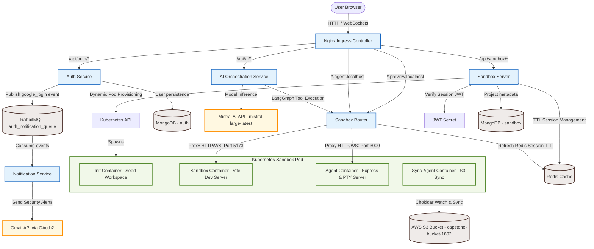
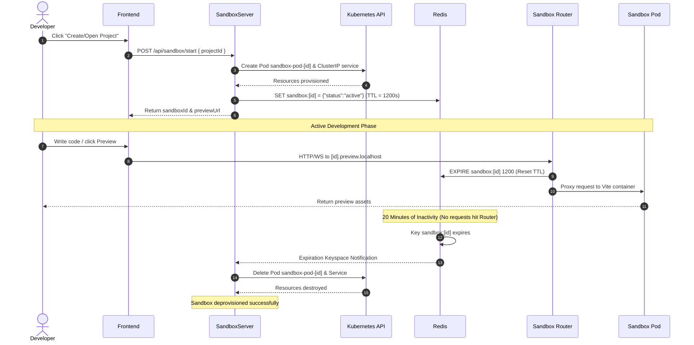

# 🌌 NovaSpace — On-Demand Cloud Sandbox & AI IDE

NovaSpace is a cloud-native, microservices-driven developer platform designed to dynamically provision isolated React/Vite development sandboxes on-demand. Through a premium Web IDE interface, developers can create project spaces, inspect files, interact with a low-latency container terminal (PTY), view real-time frontend previews, and command a specialized AI coding assistant (powered by Mistral AI via LangGraph) to automatically build, write, and modify codebase templates interactively.

---

## 🏗️ System Architecture

NovaSpace operates as an orchestrated microservices architecture deployed to Kubernetes, utilizing a reverse-proxy gateway, message broker, distributed key-value cache, and persistent storage.



### Request Flow Route
1. **API Routing**: Requests from the Frontend to `/api/auth`, `/api/sandbox`, and `/api/ai` are routed by the **Nginx Ingress** directly to the respective ClusterIP service endpoints.
2. **Subdomain Proxy Routing**: Subdomains matching `<sandboxId>.preview.localhost` or `<sandboxId>.agent.localhost` hit the **Sandbox Router** via the Ingress.
3. **Session Refresh**: The Sandbox Router updates the sandbox session expiration timeout inside Redis and forwards HTTP/WebSocket packets to the dynamic Pod's corresponding containers.
4. **Isolated Workspaces**: Changes made inside the sandbox pod are tracked by a watcher container and backed up to an Amazon S3 bucket.

---

## 🚀 Key Features

* **Dynamic Kubernetes Sandboxing**: On-demand provisioning of a custom multi-container Pod and Service for each active project. Pod runtimes include:
  * **React Dev Server Container** (`template` image): Runs Vite on port `5173`.
  * **Agent API Container** (`agent` image): Exposes filesystem endpoints and hosts a WebSocket terminal PTY on port `3000`.
  * **S3 Synchronization Container** (`sync-agent` image): Watches the `/workspace` mount via Chokidar and uploads changes to Amazon S3.
* **LangGraph AI Orchestration (FrontendForge)**: AI coding agent running on the `mistral-large-latest` model. The agent uses tools (`list_files`, `read_files`, `update_files`) to read and modify React code templates inside the container.
* **Unified Web IDE Interface**: Rich React-based workspace dashboard featuring:
  * **Responsive File Explorer**: Live polling tree representation of files in `/workspace` excluding system metadata.
  * **Pre-loaded File Viewer**: Zero-config viewer highlighting code blocks.
  * **Live Preview Panel**: An iframe that polls and renders the React project dynamically.
  * **xterm.js Web Terminal**: Responsive terminal emulator connected to the container's shell via Socket.io.
  * **AI Chat Panel**: Real-time message streaming alongside dynamic tool usage updates.
* **Secure Session Management & Google OAuth**: Token-based security using Passport.js and Google OAuth 2.0. Stores authenticated sessions in MongoDB.
* **Event-Driven Security Notifications**: Publishes user login events to a durable RabbitMQ queue (`auth_notification_queue`), consumed by a mail worker to dispatch Nodemailer email alerts via secure Gmail OAuth2 parameters.
* **Auto-scale Sandbox Cleanup**: Automatically deprovisions idle developer sandboxes. Redis keys expire in 20 minutes; expiration events trigger K8s API calls to delete the inactive Pod and Service.

---

## 🛠️ Technology Stack

| Category | Technologies & Frameworks | Description |
| :--- | :--- | :--- |
| **Frontend** | React 19, Vite 8, Tailwind CSS 4, Framer Motion, `@xterm/xterm`, `socket.io-client` | Premium user interface & responsive IDE workspace. |
| **Backend Services** | Node.js, Express, `http-proxy-middleware`, `httpxy` (reverse proxy & WS) | Rest APIs, gateway routing, and microservice business logic. |
| **AI Orchestration** | LangChain, LangGraph, Mistral AI Client (`mistral-large-latest`), Axios | Multi-turn agent workflow, tool selection, and code execution. |
| **Infrastructure** | Kubernetes Node Client SDK, Docker, Redis, RabbitMQ (CloudAMQP) | Dynamic cluster orchestration, caching, and task queuing. |
| **Databases** | MongoDB (Mongoose), Redis (ioredis session cache) | User data, project storage, and sandbox session TTL records. |
| **DevOps & Tooling** | Skaffold v4, Docker, Nginx Ingress | Local development pipelines, container builds, and local routing. |
| **Sandbox Runtime** | node-pty (C++ binding), Chokidar, AWS SDK S3 | Terminal shell spawning, directory watching, and AWS syncing. |

---

## 📂 Project Structure

```text
NovaSpace/
├── auth/                            # User Authentication Microservice (Express, port 3000)
│   ├── src/
│   │   ├── config/                  # MongoDB & RabbitMQ connections
│   │   ├── models/                  # mongoose User model
│   │   ├── routes/                  # Google OAuth & logout endpoints
│   │   └── app.js                   # Passport strategy & middleware setup
│   ├── dockerfile                   # Node:20-alpine image
│   └── package.json                 # Passport, JWT, amqplib dependencies
│
├── notification/                    # Event-driven Mail Worker (Express, port 4000)
│   ├── src/
│   │   ├── email.js                 # Nodemailer transport configured with OAuth2
│   │   ├── mq.js                    # RabbitMQ consumer channel configuration
│   │   └── app.js                   # Handles incoming queue events & status checks
│   ├── dockerfile                   # Node:20-alpine image
│   └── package.json                 # Nodemailer, amqplib dependencies
│
├── ai-orchestration/                # LangGraph AI Workflow Service (Express, port 3000)
│   ├── src/
│   │   ├── agents/                  # code.agent.js (LangGraph logic) & tools.js (agent tools)
│   │   ├── routes/                  # Post invoke SSE stream route
│   │   └── app.js                   # Express middleware configuration
│   ├── dockerfile                   # Node:20-alpine image
│   └── package.json                 # @langchain/langgraph, @langchain/mistralai, zod, axios
│
├── sandbox/                         # Sandbox Core Service
│   ├── server/                      # Dynamic Pod Creator (Express, port 3000)
│   │   ├── src/
│   │   │   ├── config/              # MongoDB & Redis event subscribers (cleaners)
│   │   │   ├── kubernetes/          # Client-node Pod and Service creation manifest files
│   │   │   ├── middlewares/         # Token validation handler
│   │   │   ├── models/              # Project mongoose model
│   │   │   ├── routes/              # create project, fetch list, start sandbox endpoints
│   │   │   └── app.js               # Router hook & middleware
│   │   └── dockerfile               # Node:20-alpine image
│   │
│   ├── router/                      # Custom Subdomain Proxy & TTL Refresher (Express, port 3000)
│   │   ├── src/
│   │   │   ├── config/              # Redis connection and expire TTL methods
│   │   │   └── app.js               # Proxy maps & WS upgrade logic
│   │   └── dockerfile               # Node:20-alpine image
│   │
│   ├── agent/                       # Pod Daemon & Shell WebSocket host (Express, port 3000)
│   │   ├── src/
│   │   │   └── app.js               # Spawns node-pty, mounts REST endpoints
│   │   └── dockerfile               # Node:20-bullseye image (installs python3, make, g++)
│   │
│   ├── sync-agent/                  # Background S3 state backup watcher
│   │   ├── sync.js                  # Sync logic, chokidar watch, S3 command handlers
│   │   └── dockerfile               # Node:20-alpine image
│   │
│   └── template/                    # Boilerplate Vite + React app loaded into workspaces
│       ├── src/                     # React source files (App.jsx, App.css, main.jsx)
│       └── dockerfile               # Node:20-alpine image
│
├── frontend/                        # Web IDE Frontend Application (React/Vite, port 5173)
│   ├── src/
│   │   ├── components/              # AiChat, FileExplorer, FileViewer, PreviewFrame, SplashScreen
│   │   ├── App.jsx                  # Main interface workspace composition
│   │   └── index.css                # Glassmorphism dark mode CSS tokens
│   └── package.json                 # Framer Motion, @xterm/xterm, socket.io-client
│
├── k8s/                             # Declarative Kubernetes Manifests
│   ├── secrets.yml                  # MongoDB, Redis, Google, AWS, & AI secrets (Opaque)
│   ├── rbac.yml                     # ServiceAccount, Role, & Binding for sandbox manager
│   ├── ingress.yml                  # Ingress routing rules & CORS configurations
│   └── *-deployment.yml / *-service.yml # Services and Deployments configurations
│
└── skaffold.yml                     # Skaffold Configuration Orchestration file
```

---

## ⚙️ How It Works (Request Flow)

```text
User Action (Create/Load Project)
  ├── 1. POST /api/sandbox/project -> Persists Project in MongoDB
  └── 2. POST /api/sandbox/start   -> Spawns K8s Pod/Service & registers active TTL in Redis
                                      (Returns previewUrl: http://[sandboxId].preview.localhost)

Proxy Subdomain Request
  ├── User views preview / types in terminal
  └── Ingress forwards to Sandbox Router (Subdomain matches)
        ├── 1. Sandbox Router calls Redis: EXPIRE sandbox:[sandboxId] 1200s (Refreshes lifetime)
        ├── 2. Sandbox Router proxies HTTP/WS to sandbox-service-[sandboxId]
        └── 3. sandbox-service-[sandboxId] maps:
                 ├── Port 80   -> Vite Dev server (renders React app preview)
                 └── Port 3000 -> Agent Container (PTY terminal & files)

AI Modification Request
  ├── User prompts: "Add a Hero section"
  └── Frontend POSTs message stream to /api/ai/invoke
        ├── 1. AI service calls model: Mistral AI decides tool call
        ├── 2. Invokes tool: list_files / read_files / update_files
        ├── 3. Sends HTTP requests: http://sandbox-service-[sandboxId]:3000/update-files
        ├── 4. Agent inside container rewrites code files in /workspace mount
        ├── 5. Sync-Agent detects modification via Chokidar, uploads edits to S3
        ├── 6. Vite dev server detects HMR reload -> forces Iframe reload
        └── 7. AI streams status message chunk to UI via SSE connection
```

---

## 📦 Services Directory

### 🔐 1. Auth Service
* **Purpose**: Manages authenticated logins and user profiles.
* **Responsibilities**:
  * Authenticates users via Google OAuth 2.0.
  * Creates user profiles in MongoDB.
  * Signs and sets HTTP-only session JWT cookies.
  * Publishes OAuth login events to RabbitMQ.
* **Endpoints**:
  * `GET /api/auth/google`: Triggers Google Passport strategy.
  * `GET /api/auth/google/callback`: Sets session cookie (`token`) and redirects user to frontend.
  * `POST /api/auth/logout`: Clears the JWT cookie.
  * `GET /_status/healthz`: Health status check.
  * `GET /_status/readyz`: Readiness status check.
* **Dependencies**: `passport`, `passport-google-oauth20`, `jsonwebtoken`, `mongoose`, `amqplib`.

### 📩 2. Notification Service
* **Purpose**: Sends security notifications via email.
* **Responsibilities**:
  * Consumes messages from the RabbitMQ `auth_notification_queue`.
  * Sends HTML email warnings to the user during successful login.
* **Endpoints**:
  * `GET /_status/healthz`: Health status check.
  * `GET /_status/readyz`: Readiness status check.
* **Dependencies**: `amqplib`, `nodemailer`.

### 🧠 3. AI Orchestration Service
* **Purpose**: Coordinates LangGraph workflow nodes and handles model inference.
* **Responsibilities**:
  * Runs the multi-turn agent logic using the Mistral AI API.
  * Translates natural language requests into structured filesystem modifications.
  * Streams status messages and code changes back to the client interface.
* **Endpoints**:
  * `POST /api/ai/invoke`: Receives `{ message, projectId }`, starts SSE stream, runs LangGraph.
  * `GET /api/status/healthz`: Health check.
* **Dependencies**: `@langchain/langgraph`, `@langchain/mistralai`, `axios`, `zod`.

### 🎛️ 4. Sandbox Server
* **Purpose**: Provisions developer environments dynamically on Kubernetes.
* **Responsibilities**:
  * Validates JWT session tokens.
  * Spawns namespaced Pods (`sandbox-pod-${id}`) and ClusterIP Services.
  * Registers sandbox sessions in Redis with a 20-minute expiry (TTL).
  * Cleans up Kubernetes resources when notified of Redis key expiration.
* **Endpoints**:
  * `POST /api/sandbox/project`: Creates a MongoDB project entry.
  * `POST /api/sandbox/start`: Provisions a sandbox and returns subdomain links.
  * `GET /api/sandbox/project`: Lists user projects.
  * `GET /api/sandbox/health`: Server health check.
* **Dependencies**: `@kubernetes/client-node`, `ioredis`, `mongoose`, `jsonwebtoken`.

### 🌐 5. Sandbox Router
* **Purpose**: Reverse proxies subdomain traffic to corresponding sandbox pods.
* **Responsibilities**:
  * Parses incoming host headers to extract `sandboxId` and target type (`preview` or `agent`).
  * Refreshes the Redis session TTL by another 20 minutes on every request.
  * Proxies HTTP requests and upgrades WebSocket connections to the sandbox.
* **Endpoints**:
  * `GET /api/status/healthz`: Health check.
  * `GET /api/status/readyz`: Readiness check.
* **Dependencies**: `http-proxy-middleware`, `httpxy`, `ioredis`.

### 🐳 6. Sandbox Agent
* **Purpose**: Hosts filesystem APIs and spawns interactive terminals inside the sandbox pod.
* **Responsibilities**:
  * Spawns a native shell PTY (`/bin/bash` or equivalent shell) via `node-pty`.
  * Emits and consumes terminal inputs/outputs via Socket.io.
  * Exposes filesystem endpoints to list, read, update, or create workspace files.
* **Endpoints**:
  * `GET /list-files`: Lists workspace files (excludes `node_modules`, `.git`, `dist`).
  * `GET /read-files?files=...`: Returns file contents.
  * `PATCH /update-files`: Updates or creates files.
  * `POST /create-files`: Bulk creates workspace files.
* **Dependencies**: `node-pty`, `socket.io`, `express`.

### 🔄 7. Sync-Agent
* **Purpose**: Synchronizes workspace file states with AWS S3.
* **Responsibilities**:
  * Downloads project files from the S3 bucket during pod initialization.
  * Watches `/workspace` for additions or changes using Chokidar.
  * Automatically uploads changes to `s3://capstone-bucket-1802/${projectId}/`.
* **Dependencies**: `chokidar`, `@aws-sdk/client-s3`.

---

## 🤖 AI Orchestration System

The AI System is configured as a LangGraph agent named **FrontendForge** inside [code.agent.js](file:///c:/Users/manis/OneDrive/Desktop/backend-2.0/NovaSpace/ai-orchestration/src/agents/code.agent.js).

### Model Configuration
* **Model ID**: `mistral-large-latest` (via `ChatMistralAI`).
* **Parameters**: `temperature: 0.7`, `recursionLimit: 100`.

### Agent Tools
The agent uses three custom LangChain tools defined in [tools.js](file:///c:/Users/manis/OneDrive/Desktop/backend-2.0/NovaSpace/ai-orchestration/src/agents/tools.js) to interact with the active sandbox pod:

| Tool Name | Arguments Schema | Functionality |
| :--- | :--- | :--- |
| `list_files` | `{}` | Calls Sandbox Agent `/list-files` to query files in `/workspace`. |
| `read_files` | `{ files: string[] }` | Calls Sandbox Agent `/read-files?files=...` to load content. |
| `update_files` | `{ files: Array<{ file: string, content: string }> }` | Sends a PATCH to Sandbox Agent `/update-files` to apply code changes. |

### Context & Execution Flow
1. **Request Received**: The frontend invokes the `/api/ai/invoke` route with the project identifier.
2. **Context Binding**: The express route passes a dynamic SSE writer callback inside the LangGraph context wrapper.
3. **Execution Loop**: The agent determines tool calls based on user prompts.
4. **Interactive Streams**: As the tools execute, they write status messages to the SSE stream (e.g. `Reading files...` or `Updating files...`).
5. **Vite Reload**: File updates write directly to the workspace, triggering Vite's HMR and updating the UI preview.

---

## 📦 Sandbox System Lifecycle

The Sandbox System utilizes Kubernetes, Redis, and a custom reverse proxy to manage the lifecycle of developer environments:



### 1. Seeding
During pod creation, an **Init Container** runs first. It extracts the pre-loaded React template framework, copying files from `/workspace` to a shared `/seed` directory mapped to an `emptyDir` workspace volume.

### 2. Execution
Once the init container completes, the main containers spawn. The Vite dev server serves the application from the shared volume. The agent container handles terminal commands, while the sync-agent container synchronizes changes with Amazon S3.

### 3. Expiry
To prevent cluster resource leaks, the Sandbox Router tracks user activity. Every request to the sandbox subdomains resets the Redis key TTL (`sandbox:<id>`) back to 20 minutes (1200 seconds). If no requests hit the subdomains for 20 minutes, the key expires.

### 4. Destruction
The Sandbox Server listens for Redis key expiration events (`__keyevent@0__:expired`). When an expiration event occurs, it calls the Kubernetes API (`deleteNamespacedPod` and `deleteNamespacedService`) to clean up the pod and service resources.

---

## 🔐 Authentication & Session Handling

NovaSpace enforces token-based authentication using Passport.js:

```text
User click Login
  ├── Redirected to /api/auth/google
  └── Passport authenticates via Google OAuth 2.0 API
        ├── Success: Find or create User profile in MongoDB
        ├── Send login event to RabbitMQ (auth_notification_queue)
        ├── Sign JWT: jwt.sign({ id: user._id }, JWT_SECRET, { expiresIn: '1h' })
        └── Set cookie: token (httpOnly: true, sameSite: 'lax', maxAge: 1h)
              └── Redirect user back to Frontend (http://localhost:5173)
```

For subsequent API requests, the `authMiddleware` validates user sessions:
* Extracts the token from the `token` cookie or the `Authorization` header.
* Decodes the JWT via `jsonwebtoken`.
* If validation fails or the token is expired, it returns a `401 Unauthorized` status.

---

## 📡 API Reference

### 🔐 Auth Service
| Method | Route | Description | Request Body | Response Format (JSON) |
| :--- | :--- | :--- | :--- | :--- |
| `GET` | `/api/auth/google` | Redirects to Google OAuth. | N/A | Redirect (Google Consent Page) |
| `GET` | `/api/auth/google/callback` | OAuth callback endpoint. Sets cookie. | N/A | Redirect (`http://localhost:5173`) |
| `POST` | `/api/auth/logout` | Clears local session cookie. | N/A | `{ "message": "Logged out successfully" }` |
| `GET` | `/_status/healthz` | Health check endpoint. | N/A | `{ "status": "ok" }` |
| `GET` | `/_status/readyz` | Readiness check endpoint. | N/A | `{ "status": "ready" }` |

### 🎛️ Sandbox Server
| Method | Route | Description | Request Body | Response Format (JSON) |
| :--- | :--- | :--- | :--- | :--- |
| `POST` | `/api/sandbox/project` | Creates a new user project. | `{ "title": "My Project" }` | `{ "message": "...", "project": { ... } }` |
| `POST` | `/api/sandbox/start` | Spins up a dynamic sandbox. | `{ "projectId": "mongodb_id" }` | `{ "message": "...", "sandboxId": "...", "previewUrl": "..." }` |
| `GET` | `/api/sandbox/project` | Retrieves all user projects. | N/A | `{ "message": "...", "projects": [...] }` |
| `GET` | `/api/sandbox/health` | Health check. | N/A | `{ "message": "Sandbox API is healthy", "status": "ok" }` |

### 🧠 AI Orchestration Service
| Method | Route | Description | Request Body | Response Format |
| :--- | :--- | :--- | :--- | :--- |
| `POST` | `/api/ai/invoke` | Invokes the AI assistant. | `{ "message": "Add banner", "projectId": "uuid" }` | Server-Sent Events (SSE) Stream |
| `GET` | `/api/status/healthz` | Health check. | N/A | `{ "status": "ok" }` |

### 🐳 Sandbox Agent (Port 3000 inside Pod)
| Method | Route | Description | Request Body / Query | Response Format (JSON) |
| :--- | :--- | :--- | :--- | :--- |
| `GET` | `/list-files` | Lists workspace files. | N/A | `{ "message": "...", "files": ["src/App.jsx", ...] }` |
| `GET` | `/read-files` | Reads file content. | Query: `?files=src/App.jsx,index.css` | `{ "message": "...", "files": [{ "src/App.jsx": "content" }] }` |
| `PATCH` | `/update-files` | Updates or creates files. | `{ "updates": [{ "file": "src/App.jsx", "content": "..." }] }` | `{ "message": "...", "results": [...] }` |
| `POST` | `/create-files` | Bulk creates files. | `{ "files": [{ "file": "src/App.jsx", "content": "..." }] }` | `{ "message": "...", "results": [...] }` |

#### WebSocket events (port 3000 / Socket.io)
* **Connection**: Initiates a shell socket connection.
* **Events**:
  * `terminal-input` (client -> server): Writes keystrokes directly to the spawned `node-pty` shell process.
  * `terminal-output` (server -> client): Streams terminal output back to the frontend's xterm window.

---

## 🔑 Environment Variables Reference

| Variable Name | Service(s) | Description | Required/Optional |
| :--- | :--- | :--- | :--- |
| `AUTH_MONGO_URI` | Auth | Connection URI for the User database. | **Required** |
| `MONGO_URI` | Sandbox Server | Connection URI for the Projects database. | **Required** |
| `REDIS_URL` | Sandbox Server, Router | Connection URL for sandbox session tracking and locks. | **Required** |
| `RABBITMQ_URL` | Auth, Notification | Connection URL for the event notification queues. | **Required** |
| `JWT_SECRET` | Auth, Sandbox Server | Secret key used to sign and verify session cookies. | **Required** |
| `MISTRALAI_API_KEY` | AI Orchestration | API Key used to access the Mistral AI API models. | **Required** |
| `GOOGLE_CLIENT_ID` | Auth, Notification | Google API credential used for OAuth logins. | **Required** |
| `GOOGLE_CLIENT_SECRET` | Auth, Notification | Google API application credential secret. | **Required** |
| `GOOGLE_REFRESH_TOKEN`| Notification | Gmail OAuth refresh token for sending alerts. | **Required** |
| `EMAIL_USER` | Auth, Notification | Email address used to send email alerts. | **Required** |
| `AWS_REGION` | Sync-Agent | AWS region of the persistent S3 bucket. | **Required** |
| `AWS_ACCESS_KEY_ID` | Sync-Agent | AWS Access Key ID for bucket synchronization. | **Required** |
| `AWS_SECRET_ACCESS_KEY`| Sync-Agent | AWS Secret Access Key for bucket synchronization. | **Required** |
| `PROJECT_ID` | Sync-Agent | Target project ID. Automatically injected by pod creator. | **Required** |

---

## 🛠️ Local Development Setup

### 1. Prerequisites
Ensure you have the following installed locally:
* **Docker Desktop**: Enable Kubernetes in settings.
* **Skaffold CLI**: Used to automate development build pipelines.
* **Node.js v20+**: Required to install dependencies.

### 2. Configure Host Names (Local Routing)
Since the Sandbox Router routes requests dynamically using subdomains, you must map the subdomain hosts locally. 
Because standard hosts files do not support wildcards (`*.`), you can configure a local DNS proxy (like **Acrylic DNS Proxy** on Windows or **Dnsmasq** on macOS/Linux), or map specific subdomains manually in your hosts file (`C:\Windows\System32\drivers\etc\hosts` or `/etc/hosts`):
```text
127.0.0.1 localhost
127.0.0.1 dashboard.localhost
127.0.0.1 preview.localhost
127.0.0.1 agent.localhost
```

### 3. Clone & Install Root Dependencies
```bash
git clone https://github.com/manishjaiswal1702/backend_2.0.git NovaSpace
cd NovaSpace
```
Install local node modules in the services to enable IDE linting support:
```bash
# Frontend
cd frontend && npm install && cd ..
# Auth Service
cd auth && npm install && cd ..
# Sandbox Server
cd sandbox/server && npm install && cd ..
# AI Service
cd ai-orchestration && npm install && cd ..
```

### 4. Deploy Secrets
Apply the base environment secrets to your Kubernetes cluster:
```bash
kubectl apply -f k8s/secrets.yml
kubectl apply -f k8s/rbac.yml
```

### 5. Start Development Environment
Run Skaffold to build container images and deploy services to the local cluster:
```bash
skaffold dev
```
Once Skaffold is active:
* The Frontend React dev server will be available at `http://localhost:5173`.
* Ingress routes API requests (e.g. `/api/auth/*`) to their corresponding pods.
* Files modified locally in service source folders will automatically trigger hot reloads.

---

## 🐳 Docker Configurations

NovaSpace service images are built from two base images depending on compile requirements:

### 1. Alpine-Based Services (`auth`, `notification`, `ai-orchestration`, `sandbox/server`, `sandbox/router`, `sandbox/sync-agent`)
These services use a lightweight Alpine image.
* **Command**:
  ```dockerfile
  FROM node:20-alpine
  WORKDIR /app
  COPY package*.json ./
  RUN npm install
  COPY . .
  CMD ["npm", "run", "dev"]
  ```

### 2. Native C++ Native Module Service (`sandbox/agent`)
The Sandbox Agent compiles `node-pty`, which contains C++ bindings. It uses a Debian-based image to build dependencies:
* **Command**:
  ```dockerfile
  FROM node:20-bullseye
  RUN apt-get update && apt-get install -y python3 make g++ && rm -rf /var/lib/apt/lists/*
  WORKDIR /app
  COPY package*.json ./
  RUN npm install
  COPY . .
  EXPOSE 3000
  RUN mkdir /workspace
  CMD ["node", "server.js"]
  ```

---

## ☸️ Kubernetes Infrastructure & Commands

All deployment manifests are located in the [k8s](file:///c:/Users/manis/OneDrive/Desktop/backend-2.0/NovaSpace/k8s) folder:

### Resources Overview
* **Secrets (`secrets.yml`)**: Groups environment configurations (DB paths, AWS, Google, and Mistral keys) into single base configurations.
* **RBAC rules (`rbac.yml`)**: Assigns a `resource-manager` ServiceAccount to the Sandbox Server. This grants the service permissions to create, view, list, and delete cluster pods and services.
* **Ingress (`ingress.yml`)**: Integrates the routing architecture using an Nginx ingress controller class (`ingressClassName: nginx`), custom read-write timeouts (6000s), and CORS parameters.
* **Deployments**: Configures replica scaling (replica = 2 for `ai-deployment`, replica = 1 for others) and defines readiness/liveness health check probes.

### Command Reference
* **Deploy everything manually**:
  ```bash
  kubectl apply -f k8s/
  ```
* **View cluster pods status**:
  ```bash
  kubectl get pods -w
  ```
* **Fetch logs for a service**:
  ```bash
  kubectl logs -l app=sandbox -f
  ```
* **Check sandbox router proxy metrics**:
  ```bash
  kubectl logs -l app=router -f
  ```
* **List dynamic namespaced services**:
  ```bash
  kubectl get services --selector=sandboxId
  ```

---

## 🔄 Development & Extension Workflow

### 1. Adding a New Service
To add a microservice to NovaSpace:
1. Create a service folder (e.g. `analytics/`) with its own source files, package configurations, and Dockerfile.
2. Define a Kubernetes deployment and service manifest inside the `k8s/` folder.
3. Update the `skaffold.yml` artifacts and RawYaml manifests list:
   ```yaml
   artifacts:
     - image: analytics
       context: analytics
   ```
4. Define routing paths inside [k8s/ingress.yml](file:///c:/Users/manis/OneDrive/Desktop/backend-2.0/NovaSpace/k8s/ingress.yml).

### 2. Modifying AI Agent Prompt or Tools
To change AI agent behaviors:
1. Edit the system prompt instructions inside [code.agent.js](file:///c:/Users/manis/OneDrive/Desktop/backend-2.0/NovaSpace/ai-orchestration/src/agents/code.agent.js).
2. To add new capabilities, define tool schemas inside [tools.js](file:///c:/Users/manis/OneDrive/Desktop/backend-2.0/NovaSpace/ai-orchestration/src/agents/tools.js) and register them in the LangGraph tool array:
   ```javascript
   const agent = createAgent({ model, tools: [listFiles, readFiles, updateFiles, myNewTool] })
   ```

---

## 🔍 Troubleshooting & Known Gotchas

### 1. AI Service key misalignment (`MISTRALAI_API_KEY` vs `MISTRAL_API_KEY`)
* **Issue**: The AI Orchestration service looks for `MISTRALAI_API_KEY` in `code.agent.js`. However, `ai-deployment.yml` injects the secret under the environment variable name `MISTRAL_API_KEY`. Because `.env` is ignored by `.dockerignore`, the service fails to fetch models in Kubernetes.
* **Solution**: Edit [k8s/ai-deployment.yml](file:///c:/Users/manis/OneDrive/Desktop/backend-2.0/NovaSpace/k8s/ai-deployment.yml) to map the env value to `MISTRALAI_API_KEY` or modify the model initialization to check both keys.

### 2. Sandbox Subdomains Do Not Resolve
* **Issue**: Accessing `http://[uuid].preview.localhost` yields a DNS lookup failure.
* **Solution**: Native OS hosts files do not support wildcard subdomains. You must manually add your temporary sandbox ID subdomain to the hosts file during testing, or run a local DNS server like Dnsmasq or Acrylic DNS Proxy to resolve `*.localhost` requests to `127.0.0.1`.

### 3. Redis Expiration Events Do Not Fire (Inactive Pods Not Cleaned Up)
* **Issue**: Inactive developer pods remain active in the cluster past the 20-minute expiry period.
* **Solution**: Redis keyspace notifications are disabled by default. Ensure keyspace events are enabled on your Redis server. The server tries to enable them programmatically during startup via `subscriber.config('SET', 'notify-keyspace-events', 'Ex')`, but this requires administrative credentials. Check the Redis server configurations if events fail to register.

### 4. Sandbox Agent fails to build during Docker compile
* **Issue**: Image compilation errors out on the `node-pty` step.
* **Solution**: Spawning node terminal shells requires native binding compilations. Ensure you build the container using `node:20-bullseye` rather than Alpine to ensure dependencies like `g++`, `make`, and `python3` are available.

---

## 🔒 Security Considerations

* **Kubernetes Isolation**: Sandbox pods run in separate container groups, limiting access to backend database connections. Memory and CPU resource allocations are enforced to prevent sandbox processes from exhausting host cluster resources.
* **Session Verification**: The Sandbox Server checks JWT tokens on incoming requests. This ensures that users can only start, query, or modify their own projects.
* **Kubernetes Secrets**: Database URIs, OAuth credentials, and API keys are stored in Kubernetes Secrets. They are injected as environment variables only within authorized pods.
* **PTY Protection**: The sandbox terminal is isolated inside the pod. It runs within a specific `/workspace` mount path, preventing access to the parent Kubernetes node.

---

## 🔮 Future Improvements

1. **Persistent Volume Claims (PVC)**: Replace S3 sync loops with persistent cluster storage mounts to improve loading speeds for large codebases.
2. **WebSocket Authentication**: Implement JWT token handshakes for Socket.io connection routes to secure access to the container terminal.
3. **Sandbox Pre-warming**: Maintain a pool of pre-warmed sandbox pods to reduce startup delays when creating new projects.
4. **Shared Sessions**: Support collaborative coding sessions by allowing multiple clients to connect to the same workspace PTY and file explorer.

---

## 🤝 Contributing

1. Fork the repository and create your feature branch: `git checkout -b feature/my-feature`.
2. Ensure linting rules pass: `npm run lint`.
3. Submit a pull request detailing the changes and implementation logic.

---

## 📄 License

This repository is distributed under the **ISC License**. See package dependency configurations for additional terms.